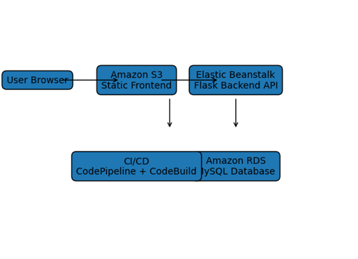
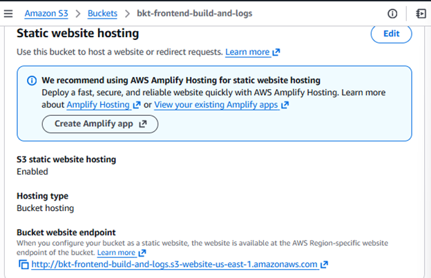
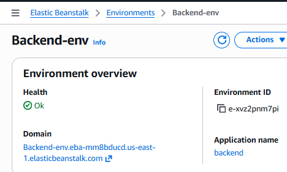
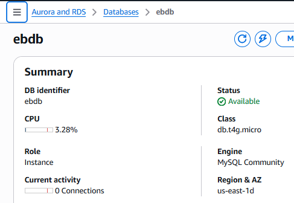
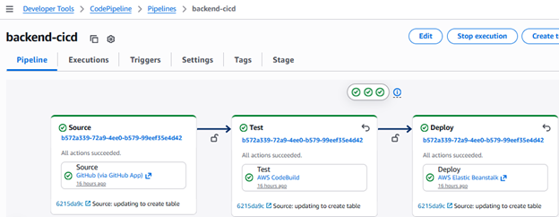
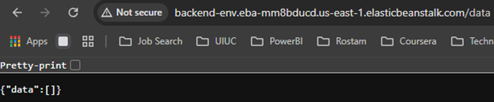

### aws-fullstack-cloud-deployment
Full-stack cloud application deployed using AWS S3, Elastic Beanstalk, RDS, and CI/CD pipelines.
### AWS Full-Stack Cloud Deployment

## Overview

This project demonstrates the deployment of a full-stack cloud application using Amazon Web Services.  
The system includes a React frontend hosted in Amazon S3, a Python Flask backend deployed with AWS Elastic Beanstalk, and a MySQL relational database hosted in Amazon RDS.  
Deployment is automated using a CI/CD pipeline built with AWS CodePipeline and CodeBuild.

This architecture mirrors real production cloud systems used for scalable web services and machine learning model deployment.

---

## System Architecture

The system follows a standard **three-tier architecture**.

User Browser  
↓  
Amazon S3 Static Website (Frontend)  
↓  
Elastic Beanstalk Flask API (Backend)  
↓  
Amazon RDS MySQL Database  

CI/CD Pipeline:

GitHub → CodePipeline → CodeBuild → Deployment

---

## Architecture Diagram

---

## Technologies Used

### Cloud Infrastructure

- Amazon S3
- AWS Elastic Beanstalk
- Amazon RDS (MySQL)
- AWS CodePipeline
- AWS CodeBuild

### Backend

- Python
- Flask
- REST API architecture
- PyMySQL

### Frontend

- React
- JavaScript
- CSS

---

## Backend API

The backend is implemented as a **Flask REST API** and deployed to Elastic Beanstalk.

Example endpoints:

- GET /events
- POST /events

The backend performs the following operations:

- Accepts requests from the frontend application
- Executes database queries using PyMySQL
- Formats responses as JSON
- Returns data to the client application

---

## Database Layer

Application data is stored in a **MySQL database hosted on Amazon RDS**.

The backend connects to the database using environment variables configured in the Elastic Beanstalk environment.

The database provides:

- persistent storage
- managed backups
- high availability

---

## Continuous Integration and Deployment (CI/CD)

Deployment is automated using AWS CodePipeline and CodeBuild.

Pipeline workflow:

1. Code changes are pushed to GitHub.
2. CodePipeline detects repository updates.
3. CodeBuild builds the application artifacts.
4. Frontend assets deploy to Amazon S3.
5. Backend application deploys to Elastic Beanstalk.
6. Logs are stored in Amazon S3.

---

## Deployment Proof

### Amazon S3 Static Website

---

### Elastic Beanstalk Backend Environment

---

### Amazon RDS MySQL Database

---

### CI/CD Pipeline Execution

---

### API Endpoint Response

---

## Repository Structure

